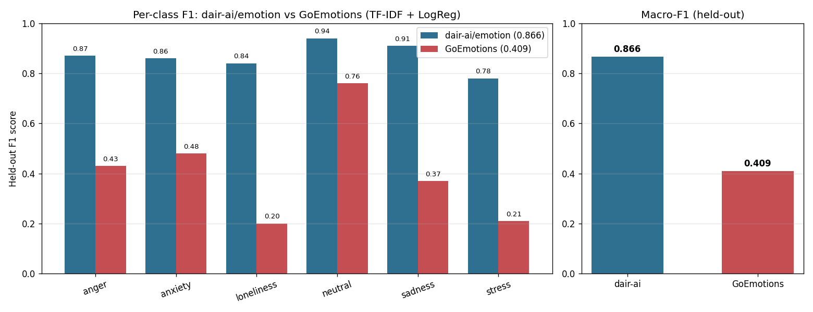
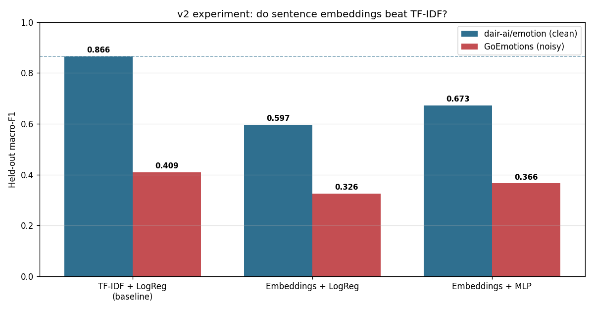

# 🌱 Supportive Emotion & Distress Text Classifier

> An NLP tool that reflects the emotional **tone** of short text and offers gentle,
> non-clinical support. It is **NOT** a diagnostic or medical tool.

## ⚠️ Important Disclaimer & Safety

This project classifies the *tone of written text*. It does **not** diagnose mental
health conditions and is **not** a substitute for professional help. If the tool
detects urgent-distress language it shows real crisis resources instead of trying
to handle the situation itself. Crisis numbers in `config.py` must be **verified and
localized** before any real use.

## ✨ Features

1. Enter a short text message
2. Text is preprocessed (clean → tokenize → lemmatize)
3. Classified into one of six tones: neutral, stress, anxiety, sadness, anger, loneliness
4. Shows a confidence score and all class probabilities
5. **Separate** high-recall rule layer flags urgent-distress language
6. Returns a gentle, non-clinical supportive response
7. Logs anonymized (text-free) signals for trend tracking
8. Visual trends over time

## 🧠 How It Works

`raw text` → **distress layer (raw)** ┐
`raw text` → preprocess → TF-IDF → LogReg → tone + confidence ┘ → combined result

- **Preprocessing** (`src/preprocessing.py`): keeps negations and `! ?`, lemmatizes.
- **Model** (`src/train.py`): TF-IDF (1–2 grams) + Logistic Regression, `class_weight="balanced"`.
- **Distress** (`src/distress.py`): auditable regex rules, tuned for **recall**, run on raw text.

## 🚀 Run Locally

```bash
python -m venv .venv && source .venv/bin/activate
pip install -r requirements.txt

# 1. Train on the included sample data (or your own data/processed/train.csv)
python -m src.train --model logreg

# 2. Run the tests (the safety layer must pass)
python -m pytest tests/ -v

# 3. Launch the app
streamlit run app/streamlit_app.py
```

> The repo ships with a tiny sample `data/processed/train.csv` so it runs
> end-to-end immediately. Replace it with GoEmotions / dair-ai-emotion (remapped
> via `data/label_map.py`) for real accuracy.

## 📊 Results & Evaluation

Held-out test (dair-ai/emotion, 2,000 unseen rows): **macro-F1 0.866**, accuracy
**0.91**, and distress-layer recall **1.00** (reported separately). Full per-class
precision/recall and the confusion matrix are in [`reports/metrics.md`](reports/metrics.md).

**📈 Interactive dashboard:** view it live at
**[namansaini04.github.io/Supportive-text-classifier/dashboard.html](https://namansaini04.github.io/Supportive-text-classifier/dashboard.html)**
(or open [`dashboard.html`](dashboard.html) locally — it's self-contained, no server
needed). KPI cards, a per-class metric chart, model comparison, class distribution,
and a confusion-matrix heatmap. A formatted report is also available as
[`reports/report.tex`](reports/report.tex) (LaTeX → PDF).

## 🔬 Datasets Evaluated

I tested **GoEmotions** (Google, ~43k Reddit comments) as a richer alternative to
dair-ai/emotion. Despite being larger, held-out **macro-F1 dropped from 0.866 to
0.409** — every tone got worse.



**Why:** GoEmotions is noisy, context-dependent Reddit text (sarcasm, slang), and
collapsing its 18 positive/ambiguous emotions into `neutral` made that class ~80% of
the test set. A bag-of-words model (TF–IDF) rewards clean, self-contained text, so
dataset *fit* mattered more than size. The takeaway: GoEmotions would need
context-aware **sentence embeddings**, not a worse dataset — a clean motivation for
the v2 upgrade. Full analysis in
[`notebooks/02_dataset_comparison.ipynb`](notebooks/02_dataset_comparison.ipynb);
the GoEmotions loader is preserved at `src/download_goemotions.py`.

### Sentence embeddings (v2) — also tested, also lost

I then tested whether dense **sentence embeddings** (all-MiniLM-L6-v2) would beat
TF-IDF, with both a linear and a non-linear (MLP) head for a fair comparison.



TF-IDF + Logistic Regression **won on both datasets**. The MLP head narrowed the gap
(it mattered to test it) but never closed it. Takeaways: (1) the task is lexically
explicit, so bag-of-words is hard to beat; (2) on noisy data the bottleneck is the
label scheme, not the features — a better representation can't fix a bad mapping;
(3) the real follow-up is *fine-tuning* the transformer, not freezing it. Full
analysis: [`notebooks/03_embedding_experiment.ipynb`](notebooks/03_embedding_experiment.ipynb).
Code preserved in `src/embeddings.py` + `src/train_embeddings.py`.

## 🗂️ Project Structure

```
config.py            labels, paths, crisis resources, disclaimer
src/preprocessing.py text cleaning pipeline
src/train.py         TF-IDF + classifier training
src/predict.py       combine emotion model + distress layer
src/distress.py      SAFETY layer (rule-based, high-recall)
src/responses.py     non-clinical supportive messages
src/storage.py       anonymized local logging + trends
src/download_data.py download + remap dair-ai/emotion dataset
src/evaluate.py      held-out evaluation + confusion matrix
app/streamlit_app.py single-screen UI
tests/               distress-layer tests
dashboard.html       self-contained interactive results dashboard
reports/             metrics.md, report.tex, confusion_matrix.png
```

## ⚖️ Ethical Design & Limitations

- Tone ≠ a person's mental state; sarcasm, context and culture break the model.
- TF-IDF matches words, not meaning.
- The distress layer **will miss** indirect/coded language — it is a safety net,
  not a guarantee, and is **not** trained on real crisis data by design.
- Trained mainly on English social-media text → biased toward that style.
- A reflection aid, **not** a clinical or crisis tool.

## 🔮 Future Improvements

- Swap TF-IDF → Sentence Transformers (`all-MiniLM-L6-v2`) and measure the lift.
- Add SHAP/LIME explanations.
- Probability calibration for trustworthy confidence scores.
- Locale-aware crisis resources and multilingual support.

## 📚 Datasets & Credits

GoEmotions (Google), dair-ai/emotion (Hugging Face), ISEAR. Remap labels via
`data/label_map.py`.
